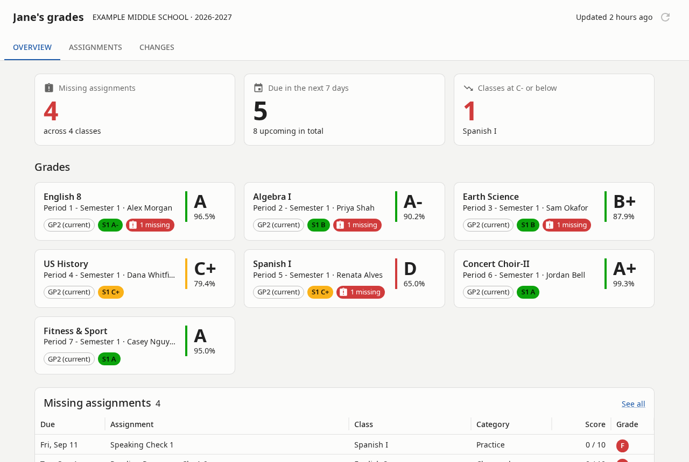
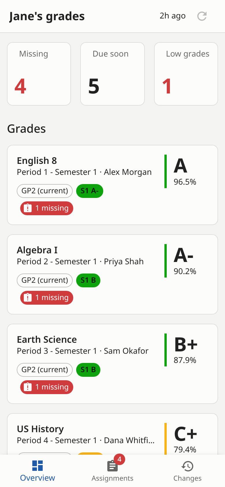
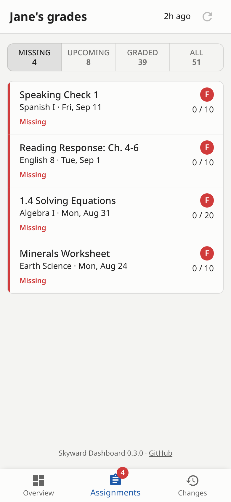
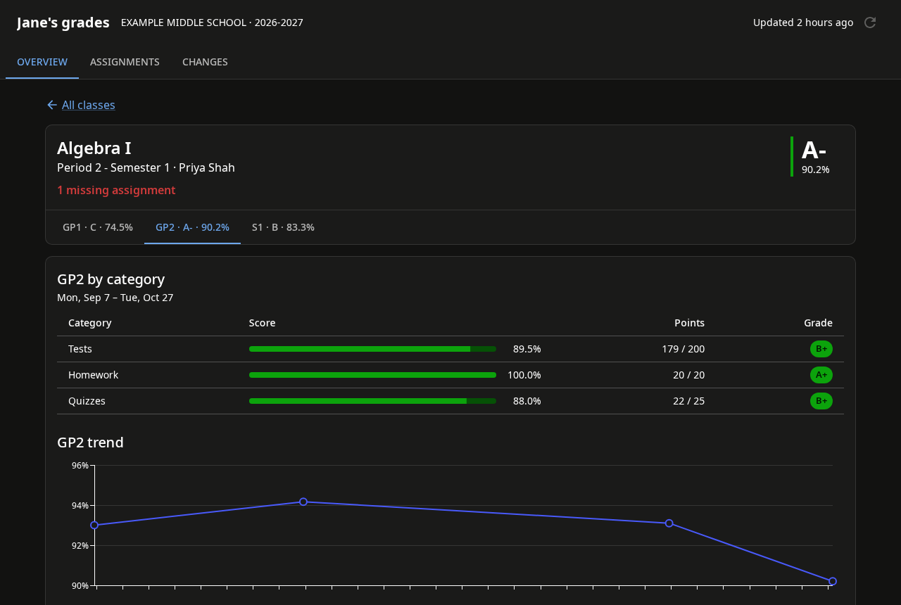

# Skyward Dashboard

A parent's dashboard for **Skyward Family Access** (Qmlativ): current grades with the percentage
and category breakdown for every grading period, missing assignments for the whole year, and what's
coming up, for every student on your account.

Skyward has no parent API, so the app signs in with your Family Access login and reads the same
pages your browser does. It updates on a schedule you choose and keeps what it fetches on your
machine; the dashboard never waits on Skyward, and nothing is sent anywhere else.



<p align="center">
  
  &nbsp;
  
</p>



*The screenshots use made-up example data.*

It works on phones, and you can add it to your home screen: in Safari, **Share → Add to Home
Screen**; in Chrome, **⋮ → Add to home screen** (or **Install app**).

## Install

You need Docker. In a new folder, create `.env` with your district's Family Access address and
your login (the address is whatever your browser shows before `/Student/...`, without it):

```sh
SKYWARD_BASE_URL=https://skyward.yourdistrict.org
SKYWARD_USER=your-username
SKYWARD_PASS=your-password
```

```sh
chmod 600 .env
curl -O https://raw.githubusercontent.com/andrewfraley/skyward-dashboard/main/docker-compose.yml
docker compose up -d
```

Open `http://<your server>:8080`. The first update runs right away and takes about 30 seconds.

Settings go in `.env` or `docker-compose.yml`:

| Variable | Default | |
|---|---|---|
| `SKYWARD_BASE_URL` | | Your district's Family Access address |
| `SKYWARD_USER`, `SKYWARD_PASS` | | Your Family Access login |
| `SKYWARD_SYNC_CRON` | `0 6-21/3 * * *` | When to update, in cron syntax: every 3 hours, 6am to 9pm |
| `TZ` | `Etc/UTC` | Timezone for the schedule, e.g. `America/Chicago` |
| `PUID`, `PGID` | `1000` | The user that owns `./data` |

Skyward allows one sign-in per account at a time, so an update may sign you out of Skyward in
your browser. The app keeps its Skyward session in `data/` and reuses it, signing in again only
when Skyward has ended it, and always as the same device, so you shouldn't get a "new sign-in"
email for every update. Keep the schedule modest.

The dashboard has no login of its own. Keep it on your home network, or put it behind a reverse
proxy with authentication. See [SECURITY.md](SECURITY.md).

## Updating

`docker compose up -d` pulls the newest release (the compose file sets `pull_policy: always`).
To stay on a release, pin the image, e.g. `image: afraley/skyward-dashboard:0.1.0`. Release notes
are on the GitHub releases page.

## API

Everything is read-only over the local copy, except `POST /api/sync`.

- `GET /api/ping`: liveness and the running version
- `GET /api/status`: the last update, the next scheduled one, whether one is running
- `POST /api/sync`: update now (409 if one is running)
- `GET /api/students`
- `GET /api/students/{id}/courses`: classes with every grading period's grade, percent and categories
- `GET /api/students/{id}/assignments?status=missing|upcoming|past`
- `GET /api/courses/{student_section_id}`: one class, its assignments and grade history
- `GET /api/changes?student_id=`: new grades, scores and missing work, newest first

Interactive docs are at `/docs`.

## Privacy

Your data stays on your machine: `.env` holds your login and `data/` holds what the app fetched.
The project repository never contains anyone's real school data. Tests use made-up, scrubbed
examples, and every commit is checked for identifying information. See
[DEVELOPING.md](DEVELOPING.md#privacy).

## Contributing

See [DEVELOPING.md](DEVELOPING.md) for running from source, how the Skyward client works, and
how releases are made.
